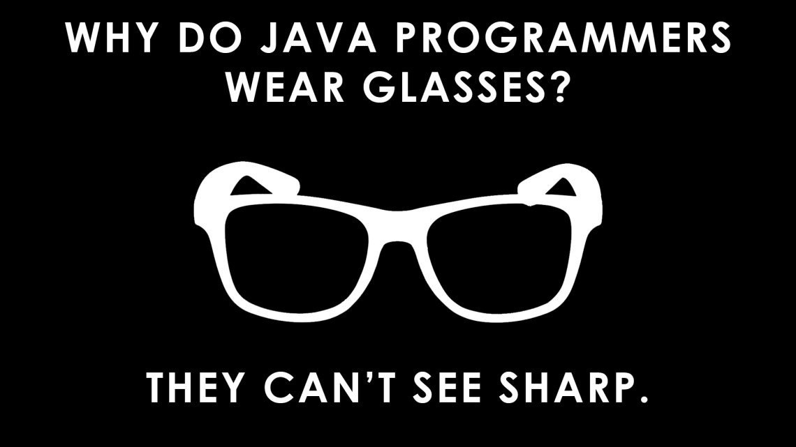
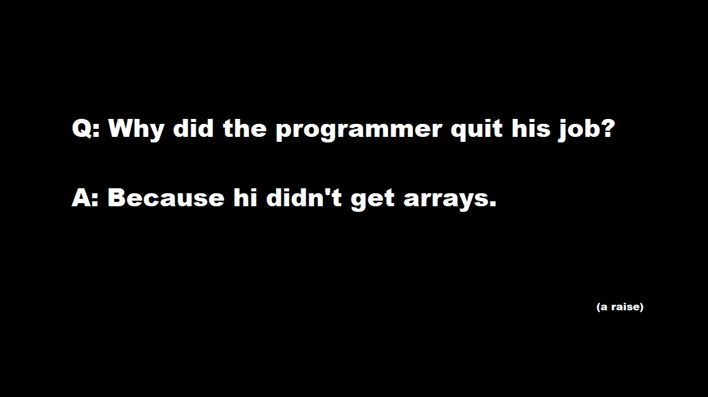

# T4B-BBI-Interview

### Part 1
1. В чем разница между IQueryable и IEnumerable?
2. Что должен возвращать метод, использующий yield?
3. Что такое record?
4. Чем отличаются Dispose(), Finalize() и деструктор? Всегда ли вызывается Finalize()?
5. Что такое nullable reference types?
6. Всегда ли value type объект размещается на стэке?
7. Что такое DI Container?
8. Что такое cartesian explosion и как с этим бороться?
9. Как написать unit-тесты на код с запросами в базу?

### Part 2
#### [Code Sample 1](https://github.com/MikeAmputer/T4B-BBI-Interview/blob/main/CodeSamples/CodeSample-1/Program.cs)
1. Что выведет код?
2. Как называется паттерн?
3. Что выведет код, если заменить Task.Run() на Task.FromResult()?
4. Как лучше всего переписать код?

#### [Code Sample 2](https://github.com/MikeAmputer/T4B-BBI-Interview/blob/main/CodeSamples/CodeSample-2/ChunkedAsyncEnumerator.cs)
1. Для чего нужен этот класс?
2. Как его можно использовать?
3. Что такое Task.Yield()?

#### [Code Sample 3](https://github.com/MikeAmputer/T4B-BBI-Interview/blob/main/CodeSamples/CodeSample-3/Program.cs)
1. Все ли в порядке в этом коде? Если нет, то что именно?
