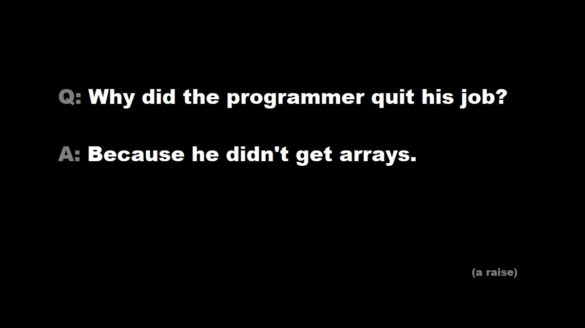

# T4B-BBI-Interview

### Part 1
1. String - это value или reference тип?
2. В чем разница между IQueryable и IEnumerable?
3. Что должен возвращать метод, использующий yield?
4. Что такое record в C#?
5. Чем отличаются Dispose(), Finalize() и деструктор? Всегда ли вызывается Finalize()?
6. Что такое nullable reference types?
7. Всегда ли value type объект размещается на стэке?
8. Что такое DI Container?
9. Зачем нужен CancellationToken?
10. Что такое cartesian explosion и как с этим бороться?
11. Как написать unit-тесты на код с запросами в базу?

### Part 2
#### [Code Sample 1](https://github.com/MikeAmputer/T4B-BBI-Interview/blob/main/CodeSamples/CodeSample-1/Program.cs)
1. Что выведет код?
2. Как называется паттерн?
3. Что выведет код, если заменить Task.Run() на Task.FromResult()?
4. Как лучше всего переписать код?

#### [Code Sample 2](https://github.com/MikeAmputer/T4B-BBI-Interview/blob/main/CodeSamples/CodeSample-2/ChunkedAsyncEnumerator.cs)
1. Для чего нужен этот класс?
2. Как его можно использовать?
3. Что такое Task.Yield()?

#### [Code Sample 3](https://github.com/MikeAmputer/T4B-BBI-Interview/blob/main/CodeSamples/CodeSample-3/Program.cs)
1. Как называется такой интерфейс (с type parameters)?
2. Зачем нужны in и out в параметрах интерфейса?
3. Что означает слово where в этом примере?
4. Все ли в порядке в этом коде? Если нет, то что именно?

#### [Code Sample 4](https://github.com/MikeAmputer/T4B-BBI-Interview/blob/main/CodeSamples/CodeSample-4/Program.cs)
1. Напишите LINQ запрос для представленной модели данных, который вернет сумму объемов трех самых крупных сделок с 1.05.2022 по 1.06.2022 для каждого клиента. Имена клиентов также нужно получить. Если у клиента не было сделок, он не должен попасть в выборку.
2. Какие индексы нужны для этих таблиц?
3. Чем отличаются clustered и non-clustered индексы?
4. С помощью каких структур могут быть реализованы индексы?
